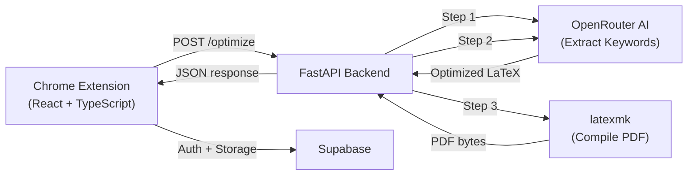

# Resume Optimizer — Walkthrough

## What Was Built

A Chrome browser extension + FastAPI backend that optimizes LaTeX resumes for job descriptions using AI (OpenRouter).



---

## Project Structure

```
Resume_Optimizer/
├── .env                          # OpenRouter API key + model config
├── .gitignore
├── extension/
│   ├── .env                      # Supabase URL + anon key
│   ├── index.html
│   ├── package.json
│   ├── tsconfig.json
│   ├── vite.config.ts
│   ├── public/
│   │   └── manifest.json         # Chrome Manifest V3
│   └── src/
│       ├── main.tsx              # React entry
│       ├── App.tsx               # Root: auth check → popup
│       ├── App.css               # Dark theme styles
│       ├── vite-env.d.ts         # Vite env types
│       ├── types/index.ts        # TypeScript interfaces
│       ├── components/
│       │   ├── AuthForm.tsx      # Login / Signup / OTP verify
│       │   ├── FileUpload.tsx    # Upload .tex / Paste code / Load saved
│       │   ├── JobDescription.tsx # JD textarea
│       │   ├── ProgressBar.tsx   # Animated step progress
│       │   └── Results.tsx       # ATS score, keywords, downloads
│       ├── pages/
│       │   └── Popup.tsx         # Main page orchestrator
│       └── services/
│           ├── api.ts            # POST to backend
│           └── supabase.ts       # Auth + resume CRUD
└── backend/
    ├── app.py                    # FastAPI: /optimize endpoint
    ├── ai.py                     # OpenRouter: keywords + optimization
    ├── latex.py                  # latexmk PDF compilation
    ├── requirements.txt
    └── venv/                     # Python virtual environment
```

---

## Files Created

| File | Purpose |
|------|---------|
| [manifest.json](file:///d:/Resume_Optimizer/extension/public/manifest.json) | Chrome extension config (Manifest V3, popup only) |
| [App.tsx](file:///d:/Resume_Optimizer/extension/src/App.tsx) | Root component — session check, routes to auth or popup |
| [App.css](file:///d:/Resume_Optimizer/extension/src/App.css) | Dark theme, animated spinner, clean minimal styling |
| [AuthForm.tsx](file:///d:/Resume_Optimizer/extension/src/components/AuthForm.tsx) | Email+password auth with OTP verification for signups |
| [FileUpload.tsx](file:///d:/Resume_Optimizer/extension/src/components/FileUpload.tsx) | Three input modes: upload file, paste LaTeX, load saved |
| [JobDescription.tsx](file:///d:/Resume_Optimizer/extension/src/components/JobDescription.tsx) | Simple textarea for pasting JD |
| [ProgressBar.tsx](file:///d:/Resume_Optimizer/extension/src/components/ProgressBar.tsx) | Animated step-by-step progress with spinner |
| [Results.tsx](file:///d:/Resume_Optimizer/extension/src/components/Results.tsx) | ATS score, missing keywords, added skills, download buttons |
| [Popup.tsx](file:///d:/Resume_Optimizer/extension/src/pages/Popup.tsx) | Main page — orchestrates the full workflow |
| [api.ts](file:///d:/Resume_Optimizer/extension/src/services/api.ts) | `optimizeResume()` — POST to backend |
| [supabase.ts](file:///d:/Resume_Optimizer/extension/src/services/supabase.ts) | Auth (signup, OTP, login, logout) + resume CRUD |
| [app.py](file:///d:/Resume_Optimizer/backend/app.py) | FastAPI — `/optimize` and `/health` endpoints |
| [ai.py](file:///d:/Resume_Optimizer/backend/ai.py) | OpenRouter integration — keyword extraction + resume optimization |
| [latex.py](file:///d:/Resume_Optimizer/backend/latex.py) | LaTeX → PDF compilation via latexmk |

---

## How to Run

### Backend
```bash
cd backend
.\venv\Scripts\activate        # Windows
uvicorn app:app --reload       # Starts on http://localhost:8000
```

### Extension (Development)
```bash
cd extension
npm run dev                    # Starts Vite dev server
```

### Extension (Chrome)
```bash
cd extension
npm run build                  # Builds to dist/
```
Then in Chrome:
1. Go to `chrome://extensions`
2. Enable "Developer mode"
3. Click "Load unpacked"
4. Select `extension/dist/` folder

---

## Setup Steps You Need To Complete

### 1. Supabase Anon Key

Go to your Supabase dashboard → **Settings** → **API** → copy the `anon` / `public` key.

Edit [extension/.env](file:///d:/Resume_Optimizer/extension/.env):
```
VITE_SUPABASE_ANON_KEY=your_actual_anon_key_here
```

### 2. Create Supabase Table

Go to Supabase → **SQL Editor** → run:

```sql
CREATE TABLE resumes (
    id UUID DEFAULT gen_random_uuid() PRIMARY KEY,
    user_id UUID REFERENCES auth.users(id) ON DELETE CASCADE,
    name TEXT NOT NULL,
    content TEXT NOT NULL,
    created_at TIMESTAMPTZ DEFAULT now(),
    updated_at TIMESTAMPTZ DEFAULT now(),
    UNIQUE(user_id, name)
);

ALTER TABLE resumes ENABLE ROW LEVEL SECURITY;

CREATE POLICY "Users can manage own resumes"
ON resumes FOR ALL
USING (auth.uid() = user_id)
WITH CHECK (auth.uid() = user_id);
```

### 3. Install TeX Live

**Windows:**
Download from https://tug.org/texlive/ and install. Make sure `latexmk` is in your PATH.

Quick check:
```bash
latexmk --version
```

---

## Deployment Options

> [!IMPORTANT]
> For the backend, you need a server with TeX Live installed. This rules out most serverless platforms.

### Best Free/Cheap Options:

| Platform | Free Tier | TeX Live Support | Notes |
|----------|-----------|------------------|-------|
| **Railway** | $5/month credit | ✅ (via Dockerfile) | Best option. Add a Dockerfile that installs `texlive-full` |
| **Render** | Free tier (750 hrs) | ✅ (via Dockerfile) | Good alternative. Free tier spins down after inactivity |
| **Fly.io** | Free tier (3 shared VMs) | ✅ (via Dockerfile) | Requires a Dockerfile |
| **DigitalOcean** | $4/month droplet | ✅ (native install) | Most flexible, cheapest VPS |

### Dockerfile for deployment:
```dockerfile
FROM python:3.13-slim

# Install TeX Live (minimal + latexmk)
RUN apt-get update && \
    apt-get install -y --no-install-recommends \
    texlive-latex-base \
    texlive-latex-recommended \
    texlive-latex-extra \
    texlive-fonts-recommended \
    latexmk && \
    rm -rf /var/lib/apt/lists/*

WORKDIR /app
COPY backend/requirements.txt .
RUN pip install --no-cache-dir -r requirements.txt

COPY backend/ .
COPY .env .env

EXPOSE 8000
CMD ["uvicorn", "app:app", "--host", "0.0.0.0", "--port", "8000"]
```

When you deploy, update the `API_URL` in [api.ts](file:///d:/Resume_Optimizer/extension/src/services/api.ts) to your deployed backend URL, rebuild the extension, and re-load it in Chrome.

---

## Verification

| Check | Result |
|-------|--------|
| TypeScript compilation | ✅ Clean (0 errors) |
| Vite build | ✅ Builds to dist/ |
| Python dependencies | ✅ All installed |
| Backend imports | ✅ `app.py` loads successfully |
| Manifest V3 | ✅ In dist/ alongside built assets |
